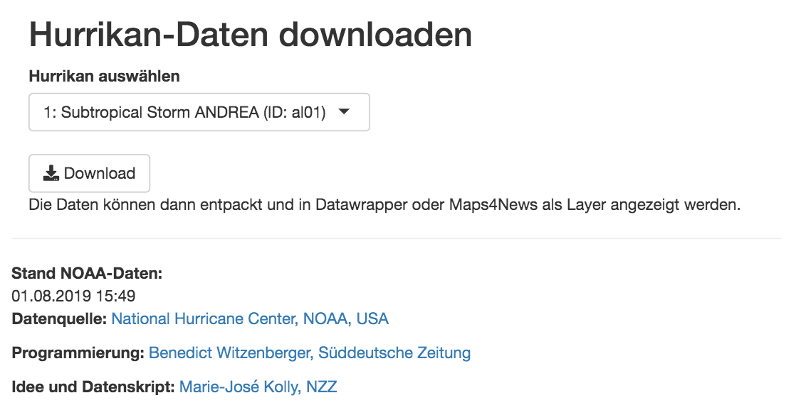

# Hurricane-App

This repo contains the code for a Shiny-app that offers all currently available hurricane data from the NHC for download as a GeoJson - suitable for most mapping tools.

## Getting Started

There are two options to install the app - both will be shortly described below: using [Docker](https://www.docker.com/) or using a [Shiny-Server](https://www.rstudio.com/products/shiny/download-server/).

### Prerequisites

#### Using Docker

In case you want to build the Dockerfile to an image, you have to install docker on your machine and (in case you want to use one) on your server. There are a lot of tutorials out there, suited to your machine. Docker will install all other prerequisites (like R, Shiny and all expected Linux packages), according to the Dockerfile.

#### Using Shiny

If you want to use the raw Shiny-App, you'll have to install [R](https://www.r-project.org/), [Shiny](https://shiny.rstudio.com/) and [Shiny-Server](https://www.rstudio.com/products/shiny/download-server/) on your system and the server, if there is one involved.

### Installing & Deployment

The app folder of this repo is structured like this:

```
hurricane_geodata_app/
├── Dockerfile
├── app
│   ├── app.R
│   ├── downloads
│   └── output
├── shiny-server.conf
└── shiny-server.sh
```

#### Using Docker

If you want to use docker, you navigate to the folder in the command line with `cd Docker_Hurricane_App/`. 

Then you run `docker build -t hurricane_app .`. The process might take some time, so you could answer some mails or grab a coffee in the meantime.

If the image was sucessfully built, you can run it with `docker run -d -p 80:80 hurricane_app`. 

`-d` detaches the process from the current terminal windows, `-p` sets the output port to 80. 

We should then be able to open the app in any browser by opening `localhost` there.

#### Using Shiny

If you plan to use the app solely on a Shiny-Server, you can ignore everything in the first level of this repo, you will only need the `app/`-subfolder:

```
├── app
│   ├── app.R
│   ├── downloads
│   └── output
```

On a clean shiny installation, you can simply put the app (with a more distinguishable name, probably) in the `/srv/shiny-server/`-folder of your shiny. It should then be accessible in any browser by typing `localhost:3838/[APP-NAME]`.

### Using the app

**What the app does:** The app downloads a list with all storms from the [National Hurricane Centers's (NHC) website](https://www.nhc.noaa.gov/gis/), that occured this year. It allow the users to select one storm. The app then downloads four different geo-layers from the NHC, which will be simplified and saved as GeoJsons:

* A line containing the historic path of the storm
* A line containing the expected future path of the storm
* A point layer which contains different points in time (historic and future) of the storm's position
* A polygon layer that shows the probability of the wind reaching more then 34knts (63km/h) - which is the lower end for a tropical storm.

The app will then create a txt-file with all the data needed for reporting (title, timestamp, source - only in German).

The layers and the txt-file will be zipped and the rusulting file is then offered for download.



## Built With

* [R](https://www.r-project.org/) - Programming Language
* [Shiny-Server](https://www.rstudio.com/products/shiny/download-server/) - App Framework
* [Docker](https://www.docker.com/) - Used to generate Image

## Contributing

Feel free to contribute to this app.

## Authors

* **[Benedict Witzenberger](mailto:benedict.witzenberger@sz.de)** - *Initial work*

## License

This project is licensed under the MIT License - see the [LICENSE](LICENSE) file for details.

## Acknowledgments

* Thanks to our colleagues from [NZZ Visuals](https://github.com/nzzdev/st-methods/tree/master/1825-hurrikan%20kartenmethodik) for their hurricane-script, which is the foundation of this app. They already sorted out, why the 34knts-level is a good visual for reporting on hurricanes. 
* Special thanks to NZZ's [Marie-José Kolly](https://github.com/mkolly) and [Anna Wiederkehr](https://twitter.com/wiederkehra).
